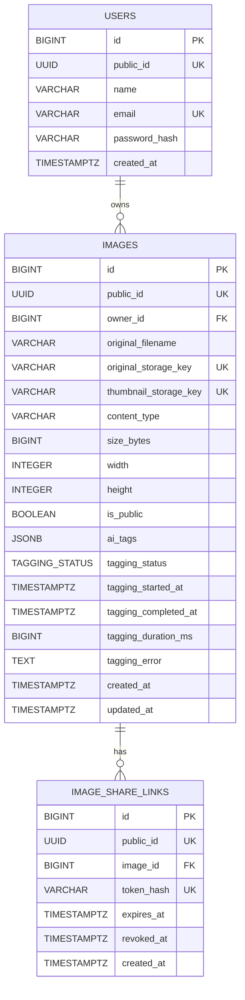

# Database ERD

The database uses numeric IDs internally and UUIDs for resources exposed through the API.

Spring Session JDBC manages its session tables separately, so they are not included in the domain ERD.